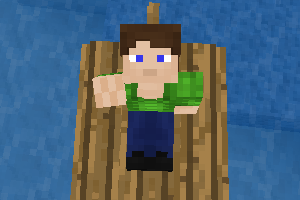

# Character Animations (`character_anim`)

Animates the character. Resembles [`playeranim`](https://github.com/minetest-mods/playeranim) and [`headanim`](https://github.com/LoneWolfHT/headanim).

## About

Depends on [`modlib`](https://github.com/appgurueu/modlib). Code written by Lars Mueller aka LMD or appguru(eu) and licensed under the MIT license. Media (player model) was created by [MTG contributors](https://github.com/minetest/minetest_game/blob/master/mods/player_api/README.txt) (MirceaKitsune, stujones11 and An0n3m0us) and is licensed under the CC BY-SA 3.0 license, as must be its derivatives (`skinsdb` and `3d_armor` variants).

## Screenshot

## Links

* [GitHub](https://github.com/appgurueu/character_anim) - sources, issue tracking, contributing
* [Discord](https://discordapp.com/invite/ysP74by) - discussion, chatting
* [Minetest Forum](https://forum.minetest.net/viewtopic.php?f=9&t=25385) - (more organized) discussion
* [ContentDB](https://content.minetest.net/packages/LMD/character_anim) - releases (cloning from GitHub is recommended)

## Features

* Animates head, right arm & body
* Advantages over `playeranim`:
  * Extracts exact animations and bone positions from glTF models
  * Also animates attached players (with restrictions on angles)
* Advantages over `headanim`:
  * Provides compatibility for Minetest 5.2.0 and lower
  * Head angles are clamped, head can tilt sideways
  * Animates right arm & body as well

## Instructions

0. If you want to use a custom model, install [`binarystream`](https://luarocks.org/modules/Tarik02/binarystream) from LuaRocks:
   1. `sudo luarocks install binarystream` on many UNIX-systems
   2. `sudo luarocks install luabitop` if you're not using LuaJIT
   3. Disable mod security. **Make sure you trust all your mods! Ideally import models with all other mods disabled.**
   4. Export the model as `glTF` and save it under `models/modelname.extension.gltf`
   5. Do `/ca_import modelname.extension`
1. Install and use `character_anim` like any other mod

## Configuration

<!--modlib:conf:2-->
### `default`

#### `arm_right`

##### `radius`

Right arm spin radius

* Type: number
* Default: `10`
* &gt;= -180
* &lt;= 180

##### `speed`

Right arm spin speed

* Type: number
* Default: `1000`
* &gt; 0
* &lt;= 10000

##### `yaw`

###### `max`

Right arm yaw (max)

* Type: number
* Default: `160`
* &gt;= -180
* &lt;= 180

###### `min`

Right arm yaw (min)

* Type: number
* Default: `-30`
* &gt;= -180
* &lt;= 180

#### `body`

##### `turn_speed`

Body turn speed

* Type: number
* Default: `0.2`
* &gt; 0
* &lt;= 1000

#### `head`

##### `pitch`

###### `max`

Head pitch (max)

* Type: number
* Default: `80`
* &gt;= -180
* &lt;= 180

###### `min`

Head pitch (min)

* Type: number
* Default: `-60`
* &gt;= -180
* &lt;= 180

##### `yaw`

###### `max`

Head yaw (max)

* Type: number
* Default: `90`
* &gt;= -180
* &lt;= 180

###### `min`

Head yaw (min)

* Type: number
* Default: `-90`
* &gt;= -180
* &lt;= 180

##### `yaw_restricted`

###### `max`

Head yaw restricted (max)

* Type: number
* Default: `45`
* &gt;= -180
* &lt;= 180

###### `min`

Head yaw restricted (min)

* Type: number
* Default: `0`
* &gt;= -180
* &lt;= 180

##### `yaw_restriction`

Head yaw restriction

* Type: number
* Default: `60`
* &gt;= -180
* &lt;= 180

### `models`

Other models, same format as `default` model
<!--modlib:conf-->

## API

Minetest's `player:set_bone_position` is overridden so that it still works as expected.

### `character_anim.set_bone_override(player, bonename, position, rotation)`

The signature resembles that of `set_bone_position`. `bonename` must be a string. The following additional features are provided:

* Using it like `set_bone_position` by setting `rotation` and `position` to non-`nil` values and using `""` to set the root bone
* *Setting only the bone position* by setting `rotation` to `nil` - bone rotation will then be model-animation-determined
* *Setting only the bone rotation* by setting `position` to `nil` - bone position will then be model-animation-determined
* *Clearing the override* by setting both `rotation` and `position` to `nil` ("unset_bone_position")